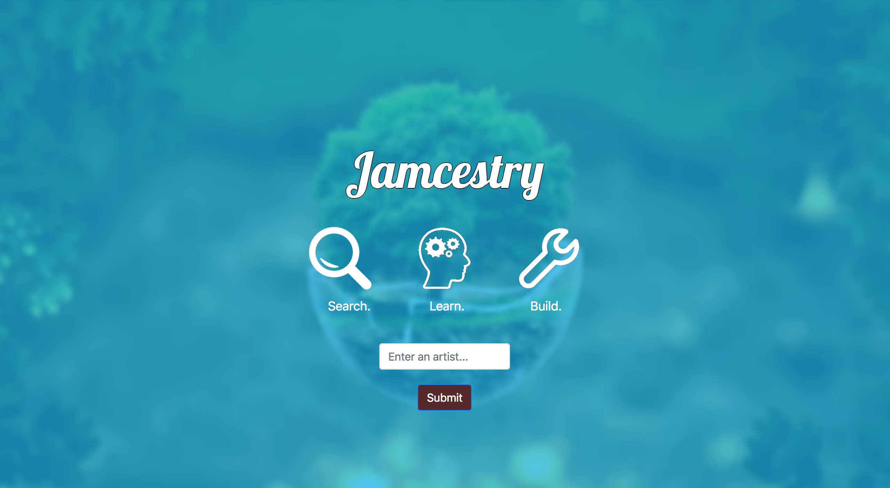
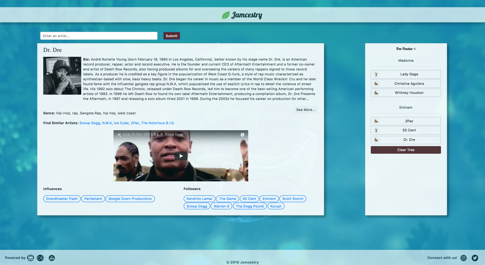

# Jamcestry
Welcome to Jamcestry - an application built for music fanatics everywhere. 

https://jstep1.github.io/Jamcestry/index.html

Find your favorite artists and...

- Read about their bio, genres, and similar artists
- Check out their music, interviews, and more
- See which artists influenced their music and those who were influenced by them

You can even build a "Tree Tracker" to see the historical progression that created this artist and the impact they have had on the music industry:

We hope you enjoy using this application as much as we did building it. Please contact one of the contributors if you have any questions.

# About This Project
Jamcestry was built using the following technologies:

<b>Programming Languages</b> 
HTML 
CSS (Bootstrap) 
Javascript/jQuery 
 
<b>APIs</b> 
Napster 
LastFM 
YouTube 
 
Please see the source code for more information about this project.

# Collaborators
Jeremy Stepanovich 
https://github.com/jstep1 
 
Anthony Peterson 
https://github.com/arpeterson78 
 
Mike Binder 
https://github.com/mikebinder 
